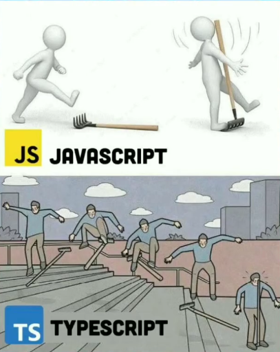

## As a Newbie

When I first chose to take ICS 314, I obviously knew that I was signing up to learn about software engineering. But I didn't clearly know the difference between software engineering and computer science. It means that I didn't know how I would be learning software engineering. I still don't know for sure, but learning to use TypeScript gave me an idea of software engineering. Using TypeScript for the first time, I felt that it is more intuitive than other programming language. I'm assuming that with more intuitive language, we are to learn hard concepts of software engineering more easily. 

## Intuitiveness

A programming language being intuitive means that it can be learned easily. But if there are pros, there are always cons. The intuitive nature of TypeScript is good for the people who just started programming. But the factor which helped programming beginners might become a difficulty for the programmers who has only shallow experiences of other programming languages. Here's an example; C is a language that we all get to learn in ICS 212. There are way more data types in C compared to TypeScript and when a programmer who only has experienced C gets confused because they would have to adapt to more simple and intuitive data types.
This assumption might apply to someone, but surely not everyone. For the programmers who have more than a few programming language experience, TypeScript should just be one of the easy languages.

## In the context of relationships

So in the end, we realize that all engineering and programming is there for a reason - to serve human needs. Maybe that's why those things are difficult, because they both involve humans and are for humans.

Relationships, regardless if they're romantic or not take work. Humans are fickle creatures and relationships can come and go with the wind. To properly maintain something over time requires work. Family takes work. Marriage takes work. We live to figure out what works and what doesn't and hope that as we move forward we're improving.

Relationships have always been difficult, and by nature will continue to be so.

